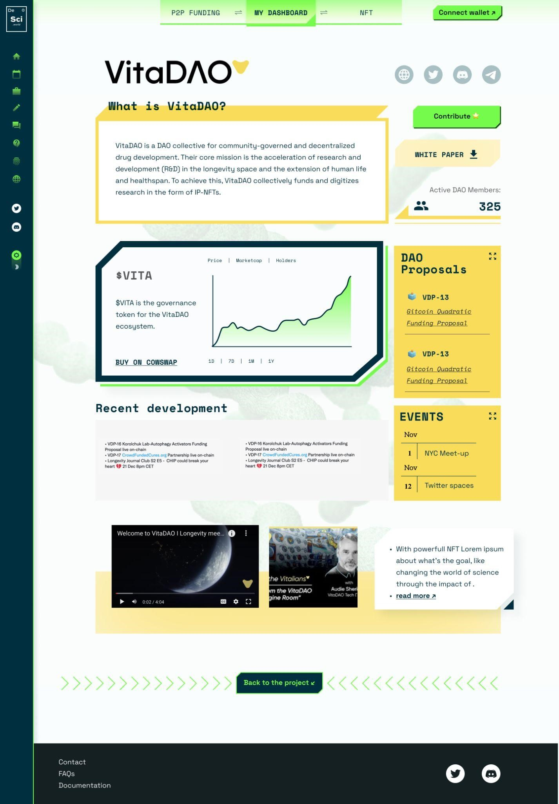

# DeSci Dashboard

The DeSciWorld Dashboard is a free-to-use online information hub that aggregates and displays information about DeSci projects in an easily digestible format. It allows researchers/academics/VCs/non-scientists to obtain information about all DeSci-relevant projects.&#x20;

### <mark style="color:blue;">Main Dashboard</mark>

<figure><figcaption>
<a href="https://desci.world/dashboard"><em><mark style="color:blue;">https://desci.world/dashboard</mark></em></a>
</figcaption></figure>

### <mark style="color:blue;">Individual project pages</mark>

Project pages display relevant information about individual DeSci projects, such as information about tokens and governance proposals, media embeds, short descriptions and relevant links. These pages allow users to get a quick overview of a project before fully diving into their community.

<figure><figcaption>
<a href="https://desci.world/project/625fb37edcfaec643ea479aa"><em>https://desci.world/project/625fb37edcfaec643ea479aa</em></a>
</figcaption></figure>
-At0x was here
#### ◈ To apply to have your project listed, please fill out this [form](https://cutt.ly/RHCFQIh).
