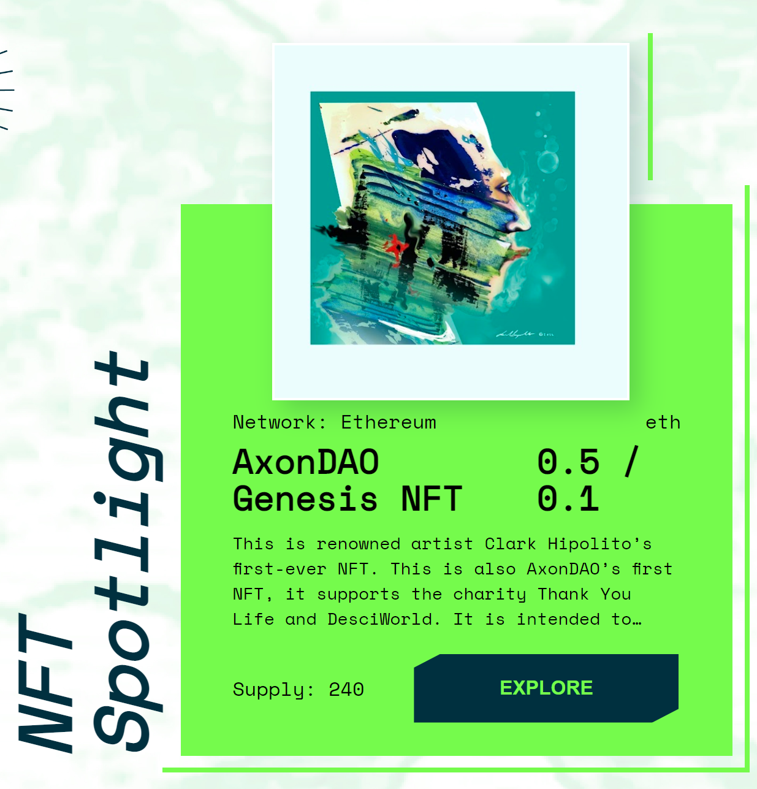

# NFT Spotlight

The NFT Spotlight features projects that utilize NFTs to combine art and science in a biweekly cadence. DeSciWorld enables users to mint, view and shares these exclusive project launches.&#x20;

<figure><figcaption>
<a href="https://desci.world/nft"><em>https://desci.world/nft</em></a>
</figcaption></figure>

### <mark style="color:blue;">a. Minting contracts</mark>&#x20;

The DeSciWorld development team will help produce minting contracts for NFT project partners. We currently offer a standardized minting contract on the Ethereum mainnet coupled with any technical support that may be necessary to help partners launch an NFT project. Minting is hosted on the DeSciWorld website, but can also be hosted on the individual project site.

### <mark style="color:blue;">b. Spotlight</mark>&#x20;

In addition to technical assistance, we provide outreach for impactful projects. During the biweekly period that the project is featured as DeSciWorld’s NFT Spotlight, the sale will appear on the desci.world landing page and the cover of the NFT Products section.&#x20;

During the duration of the project spotlight, the project team will receive exclusive rights to the <mark style="background-color:yellow;">#💎¦spotlight</mark> channel on DeSciWorld [Discord](https://discord.gg/gKazMbU8a6), and DeSciWorld will collaborate to organize AMAs and other signal boosting events.

### <mark style="color:blue;">c. Community Construction</mark>&#x20;

We aim to help new and developing projects build a strong and thriving community for their launch. As a continued service beyond the Spotlight period, collaborators will be granted ongoing access to highlighted channels in our discord and Twitter lists for future announcements and referrals between our communities.&#x20;

### <mark style="color:blue;">d. Collection on NFTKEY</mark>&#x20;

DeSciWorld has an exclusive long-term partnership with NFTKEY, a curated NFT marketplace and gallery, where we have been given a separate and dedicated interface for hosting and sharing DeSci NFTs. Featured projects on the NFT Spotlight will also receive a guaranteed space on the NFTKEY platform.

#### ◈ If you are interested in producing DeSci-NFTs for your research, data or project - or becoming a Partner Project - fill out the NFT Listing [form](https://airtable.com/shrZPaz9v9HrTrxnH).
