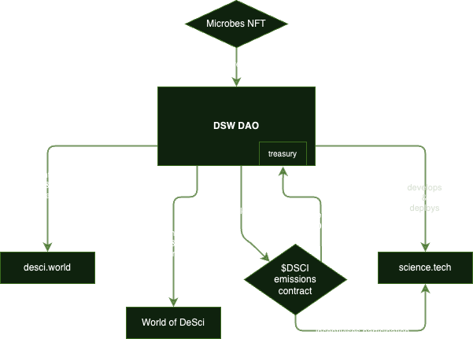

# Role and Responsibilities

### DSWDAO's Role

The primary role of DSW DAO is to facilitate the launch and sound operation of the DeSciWorld ecosystem, including desci.world, science.tech and the World of DeSci conference circuit. DSW DAO is an evolving structure that is governed by the [Microbes NFT](governing-dsw-dao/).&#x20;

<figure><figcaption></figcaption></figure>

To deliver on its role, DSW DAO will access the resources held in its multisignature wallet.


The DSW DAO is not yet deployed, thus all information here is displayed for informational purposes only. It is suggestive and not prescriptive for the operations of DSW DAO. Full managerial authority over its goals and operations lies with the DAO Governors.


Responsibilities

1. Ship web3-enabled products and tools that unlock the potential of open research
2. Further the mission of DeSciWorld in a value-aligned way
3. Support the development of the DeSci ecosystem and global community
4. Maintain accountability in leadership, both internally to the DAO and in DeSci proper
5. Act as the issuing authority of $DSCI emissions contracts

***

## The relationship between:&#x20;

### DSW DAO and [science.tech](http://science.tech)

The primary function of science.tech is to provide permissionless access to on-chain tooling. Through the Research Collectives, descientists have an open-governance mechanism for their research goals. Each Collective is self-governing unit, seperated from the control of DSW DAO through its unique governance token. You can consider science.tech an incubated platform by the DSW DAO.&#x20;

DSWDAO is tasked with developing and deploying the science.tech smart contracts. It will continuously deploy new products, updates and fixes. It will maintain the infrastructure necessary to serve thousands of researchers. The Research Collectives provide a seperation of authority from DSWDAO, giving autonomy over finances and operations to each Collective.

The $DSCI token emissions that are primarily used to incentivise science.tech participation are initially deployed by DSW DAO.

Understanding the DSW DAO as a facilitator of DeSci makes for a better appreciation of the DAO's purpose; the goals of DSW DAO align with proliferating access to decentralised tools through science.tech.&#x20;

### DSW DAO and [$DSCI](../ecosystem/usddsci-or-usdknow-token.md)

The $DSCI token is deployed via two methods:

1. Token Generation Event (TGE)
2. Emissions Schedule

Both the TGE and the Emissions Schedule will be organised and executed by the DSW DAO.&#x20;

### DSW DAO and [desci.world](../ecosystem/terminal/)

desci.world is considered a curated platform; it is DSW DAO's role to assume curator.

The DAO is tasked with maintaining the dataroom, adding new features and engaging with listings and sponsors. It will continuously aggregate information and news for the public good of proliferating DeSci. Working together with listed projects to provide the most optimal experience for both user and project teams.

Further, Spotlight and NFT listings are not permissionless; application and selection require discussions with DAO members to initiate.&#x20;

### DSW DAO and [World of DeSci](../ecosystem/world-of-desci/)

The World of DeSci conference circuit requires a significant amount or coordinated effort and resources. The DSW DAO acts the primary facilitator and overseer of the process.
