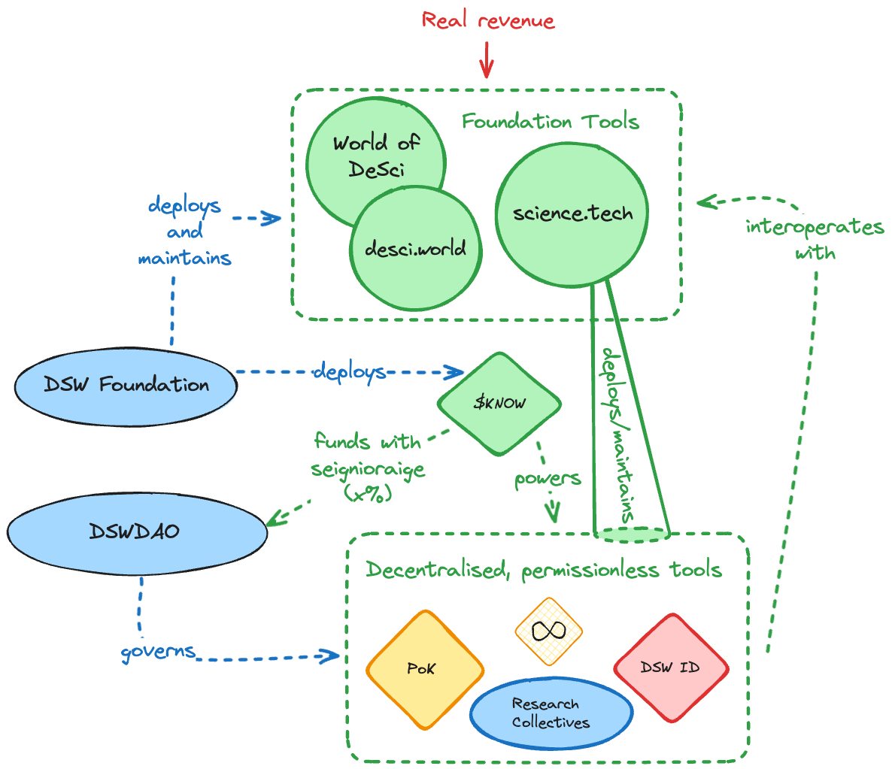

# Research Collectives

### Understanding Research Collectives: A new way to organize open research&#x20;

Research Collectives represent a mechanism for the decentralized science community to organize around knowledge creation and to access funding.&#x20;

A researcher focusing on niche or underserved areas may struggle to obtain resources for their early-stage work. DeSciWorld provides researchers with tools to share their work and facilitate their research pursuits through decentralized funding methods.&#x20;

### Research Collectives

The concept of Research Collectives emerges as a fundamental mechanism in decentralized science, facilitating the convergence of researchers who share a fervent interest in a particular domain. This paradigm enables these individuals to forge connections, engage in collaborative endeavors, and collectively contribute to an expansive knowledge base.

<figure><figcaption></figcaption></figure>

Members of the Research Collectives can autonomously govern themselves via the subDAO infrastructure. They may create and amalgamate kEngrams, uniting them in a coherent repository of collective research, leverage on-chain assets, participate in token-weighted governance and more.

### Create your Research Collective

To create a Research Collective, the following steps need to be followed:

1. Creating Initial Research Engrams

* The individuals focusing on a specific research topic start by creating the first kEngrams of the research project. This can contain their existing research and knowledge.
* The researchers use the DeSciWorld protocols to submit their questions and answers on the platform.
* These kEngrams get validated through the Proof of Knowledge protocol and added to the DeSciWorld ecosystem.

2. Adding Research Engrams to the Collective

* Once the initial research engrams are created and validated, these engrams can be combined to create a Research Collective.
* This collective acts as a hub for researchers to combine their knowledge, compare notes, collaborate on shared topics of interest, and contribute to the body of research within that specific area.

3. Management and Expansion of a Research Collective

* The collective is overseen by its contributing researchers. Its expansion is facilitated by the addition of new kEngrams by both existing and new researchers.
* Researchers can join collectives that align with their interests or expertise, contributing their unique perspectives and research to the collective’s knowledge base.
* Researchers can also leverage the resources provided by DeSciWorld, including collaborative tools, validation services, and communication platforms to enhance their research efforts.

### Monetization of Research through Proof of Knowledge

The PoK (Proof of Knowledge) mechanism rewards knowledge contributions within the DeSciWorld ecosystem. This applies to the research shared within Research Collectives.&#x20;

* As the kEngrams within a collective are used and referenced within DeSciWorld, the creators of these kEngrams receive DSW tokens as rewards.
* This system incentivizes the creation and distribution of high-quality research, providing a revenue stream to researchers while enhancing the overall quality of Research Collectives.

Conclusion

***

In the DeSciWorld ecosystem, Research Collectives are a dynamic confluence of researchers collaboratively with access to funding to output proof of knowledge. With the integration of the PoK framework, these collectives provide an excellent means for researchers to generate, validate, share, and monetize their research.

Researchers that are passionate in a field that is not _en vogue_ often struggle to source contributions towards their early-stage research. DeSciWorld understands this challenge and seeks to support researchers with a plethora of tools to overcome this high first hurdle.&#x20;

### Introducing Research Collectives&#x20;

The DSW team experienced the traditional research process and understands it creates a multitude of challenges for scientists.&#x20;

Researchers are a key component in the DeSciWorld ecosystem with community platforms and tooling built specifically for researchers.&#x20;

Research collectives will be at the core of the DSW ecosystem...

\[Insert overview of research collective]

### Research collective tokenomics&#x20;

\[Insert stuff from Josh re tokenomics around this]

\
!! Insert CTA for reserach collectives&#x20;
