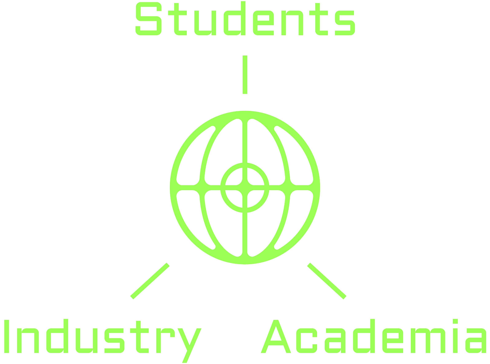

# The Vision

The future of knowledge and understanding is at risk of extreme, parasitic corporatisation. Alongside our raidly changing roles as workers in society, automation is affecting the way we receive and judge information. A majority of critical thought is done for us,&#x20;

## Why are we here?

DeSciWorld was created in September 2021, after the COVID pandemic exposed some fundamental concerns with the scientific paradigm: censorship, bias, illicit public-private partnerships, profiteering, inefficiencies, uninformed populations, uneven distribution of data and medicine, to name a few.

In a time of converging technologies, handing the right to determination of the future of humanity, the keys to the ignition of tools of destruction, the honour of shepherding the great masses of the world to _**any one entity**_ is a folly.&#x20;

We must create tools that decentralise and distribute the power that is afforded to technology, before that power is absolute. Guided by the mission to unite and empower the decentralized research community, DeSciWorld’s commitment is to facilitate a scientific renaissance in an authentic, transparent, and resilient manner.&#x20;

## Knowledge Backed Economy

The team and partners at DeSciWorld believe in a better incentivised and more democratised future of knowledge creation and exchange. With the progress in AI systems, knowledge and its author may become seperated irretrievably. The data we produce informs inteliigent systems operating for profit and can be used in research without attribution. We deserve our share.



## Trifecta of Effective Integration

For the future of science to be sufficiently decentralised, we must include the full spectrum of participation. We propose the framework of tripartite collaboration between students, academia and industry to reach this end.&#x20;

In a bid to achieve the truly distributed scientific community that Decentralised Science dreams of, we must bring the tools to the people who need them.

<figure><figcaption></figcaption></figure>

### Students 

Students are the lifeblood of science. Young, passionate and often wonderfully optimistic, we believe that the most powerful and revolutionary ideas will come from this group. On the one hand students tend to have less vested interest in continuing the encumbency of the status quo — the system has caused many issues in the world that they must now tackle. On the other hand, students have less to lose and are more willing to take calculated risks. DeSci is primed for their adoption.

### Academia 

Academic societies dictate the direction of the populations as their research and recommendations influence policy at all levels. Think tanks are the sages of old. It is essential that the DeSci community demonstrates to these powerful substrates that decentralisation and the redistributive potential that comes with it is the best method to cure the ills that we face today. In order to influence policy, we must enlighten policymakers.

### Industry 

Finally, the theoretical underpinning of students and academia wont achieve much without the practical applications of industry. The trend of the last century is for competent scientists to go where they receive the best compensation — Western scientific industry. Indian doctors go to Europe, African pharmacists go to Big Pharma, South American chemists do their research in the US. This has invariably left local research communities lacking in both talent and funding. A deadly cycle that can only be broken by brave individuals creating value in their own lands. DeSci can be a core toolset to empower local industry, who in turn can compete with the global scientific industry.

\
